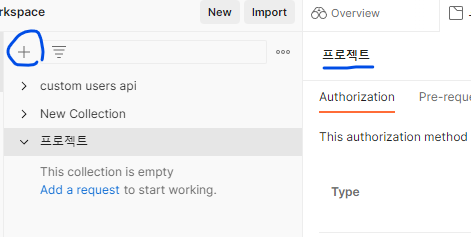
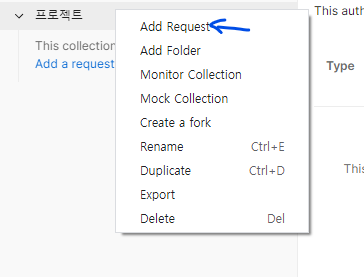
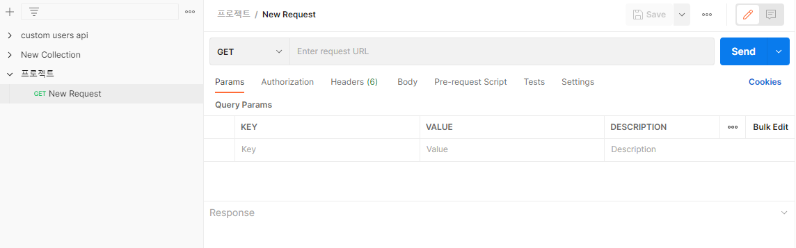
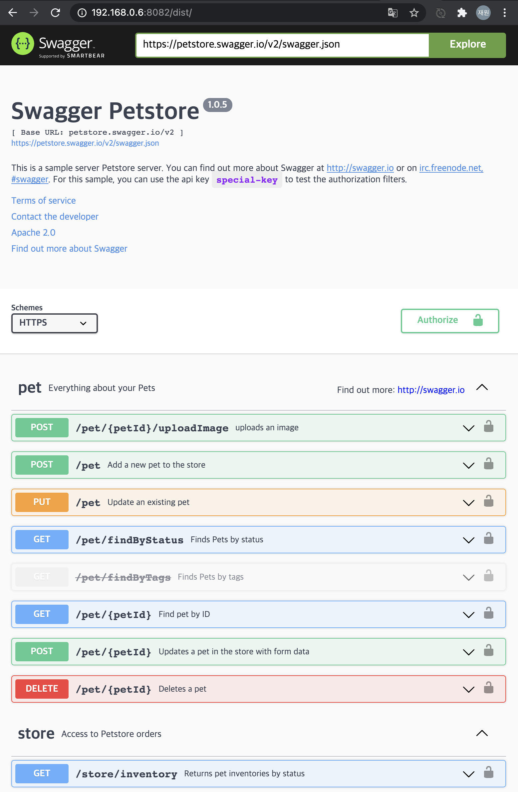
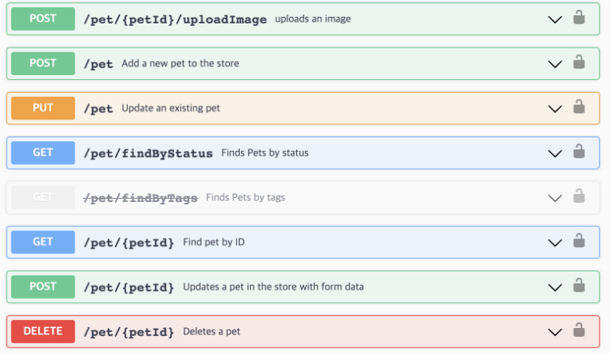
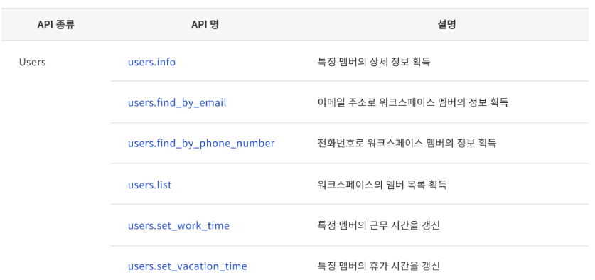
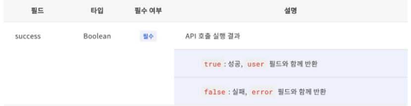

# Web 10주차 워크북

## 수업 내용 정리

(수업에 관련해서 기억하고 싶은 내용 및 배운 내용을 정리해주세요. 실습이 있을 경우, 실습한 내용을 캡쳐해주세요.)

- 협업의 중요 포인트
    - 디자인 시안이 나오면 프론트와  백이 동시에 개발에 들어가게 되는데 이때 그냥 기다리는 것이 아니라 디자인 시안을 보고 **퍼블리싱**을 미리 하고 있는 것이 가장 중요하다.
    - 퍼블리싱? → 클론 코딩에서 자주 쓰이는 용어로 외적으로 봤을 때나 직관적으로 보았을 때 가장 비슷하고 똑같이 구현이 되어야하는 요소를 말함
    - 퍼블리싱을 할 때에는 더미데이터를 만들어서 임시로 데이터를 만들어서 구현하는 것도 좋다.
- api 명세서
    - 보통은 명세서에 메서드와 URI가 나와있고 그에 대한 백쪽의 정보가 다 들어가 있다.
    - 어떤 에러인지 Status를 명세하기도 하고 그에 대한 Response도 정해준다.
    - api 명세서의 대표적인 프로그램 : **Postman**
- Postman

  

    + 버튼을 누르고 새로운 컬렉션을 생성 후에 내가 원하는 이름으로 바꿔준다.

  

  add request를 눌러주면

  

  이렇게 메서드를 테스트할 수 있는 화면이 나온다.

  여기서 테스트를 하면서 status와 body, response 등을 확인하며 명세서를 분석한다.

    - comment 기능도 있어서 백끼리나 백과 프론트끼리 서로 소통할 수 있다.
    - 내가 만들어 놓은 메서드를 코드화 시키는 기능도 제공

## ✅ 실습 체크리스트

- api 명세서를 검색해보고 분석해보세요!

  

  

  서버와 통신을 할 수 있는 base url

    
    1. pet id가 전달되고 그 url에서 이미지를 업로드하면 그 이미지 데이터가 전달된다.
    2. pet 의 새로운 정보를 추가하하면 그 정보 데이터가 전달된다.
    3. 이미 존재한 pet 정보들을 수정한다.
    4. pet 상태나 정보를 찾을 수 있게 그 정보들을 불러온다.
    5. petID를 찾을 수 있게 그 id 데이터들을 불러온다.
    6. petID에 따라 삭제할건 삭제할 수 있게 해준다.

- [ ]  백엔드 개발자와 협업할때 갖춰야 하는 마음가짐에 대해서 토론해보세요
    - **의사소통이 가장 중요한 것 같다.**
        - 그러기 위해서는 첫번째로 명확한 설계와, 개발 프레임워크를 구축해야 나중에 발생할 문제를 방지하거나 문제 발생을 막을 수도 있을 것 같다.
        - 서로 공유한 코딩 방법대로 맞춰서 코드 짜기 - 서로 논의된 표준을 따르기로 약속하는 것도 중요한 것 같다.

## 🎯 핵심 키워드

- **api 문서**
    - **좋은 API 문서 작성 Tips**
        - 만약 API 간 공통되는 에러 코드가 존재한다면, 문서의 한 섹션에 에러 코드를 모아두고 관리를 하는 것이 효율적
        - **API 리스트업**

          

        - **시각적 UI 활용**
            - API 설명이 반복되는 글이라서 자칫하면 잘못 보거나 지루함

          -> 테이블 계층화나 코드 블럭 등 시각적인 요소들을 활용해 직관적으로 글을 작성하는 것이 필요

          

        - **지속적인 업데이트**
            - 사용자 입장에서는 문서의 지시를 분명히 따랐음에도 불구하고 API를 원하는 대로 사용할 수 없거나 잘못된 결과가 나올 수 있으니 지속적인 업데이트가 필요
- **백엔드 개발자와 협업하는 방법**