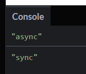

- 동기 = synchronous : 순서대로 일을 처리하는 방식
- 비동기 = asynchronous :  순서대로 일을 처리하지 않고 빨리 처리할 수 있는 것들을 먼저 처리하는 방식

### setTimeout 메서드 : 비동기 함수의 대표적인 메서드
```jsx
console.log('1')
setTimeout(function() {
    console.log('2')
},10)
console.log('3')
console.log('4')
setTimeout(function() {
    console.log('5')
},5)
console.log('6')
setTimeout(function() {
    console.log('7')
},40)
console.log('8')
setTimeout(function() {
    console.log('9')
},30)
console.log('10')
```

이런식으로 위에서 아래로 코드를 찍을 때 실행할 수 있는 console.log 부터 쫙 출력을 하고 그 다음에 비동기적으로 찍는 것임.

- 구조

    ```jsx
    setTimeout(function() {
        console.log('2')
    },10)
    ```

  function안에 첫번째인자로 콜백을 받고, 얼마나 delay 시킬 것인지 밀리세컨드로 입력으로 받는 구조

  ‼️주의 : 뒤에 받는 딜레이 밀리세컨드 인자는 실행되자마자 측정되는 것이 아니라 동기가 다 끝난 후 비동기가 시작될때 측정이 시작된다.

### 콜백함수

```jsx
function syncFunc(syncCallback) {
	syncCallback();
}

function asyncFunc(asyncCallback) {
	setTimeout(asyncCallback, 1);
}

syncFunc(() => console.log('sync'));
asyncFunc(() => console.log('async'));
```

여기서 `syncFunc`안의 `(() => console.log('sync'));` 와 `asyncFunc`안의  `(() => console.log('async'));`가 콜백함수라고 보면 된다.

일단 위의 코드를 돌려보면 콘솔에는 sync가 먼저 찍히고 async가 몇초후에 찍히는 것을 알 수 있다. 이유는 syncFunc가 콜백함수지만 동기고 asyncFunc 가 비동기이기 때문이다.

**콜백을 쓰는 가장 대표적인 이유는 동기와 비동기를 같이 썼을 때 순서를 보장 받을 수 있기 때문에 유용한다.**

근데, 만약 위 코드에서 sync보다 async를 먼저 출력시키고 싶다면?

```jsx
function syncFunc(syncCallback) {
	syncCallback();
}

function asyncFunc(asyncCallback) {
	setTimeout(()=>{
    asyncCallback();
    syncFunc(() =>console.log('sync')); //이렇게 중첩시켜서 써주면 된다.
  }, 3000);
}

asyncFunc(() => console.log('async'));
```



그럼 이렇게 순서가 바뀌어서 잘 나오는 것을 확인 할 수 있다.

### 실습해보면서 알아보기

- 어떤 블로그 글의 id값을 입력하면 그 id에 해당하는 코멘트를 보여주는 작업을 진행
- 먼저 데이터가 들어가있는 배열 만들어주기

    ```jsx
    const posts = [
      { post_id: 1, post_title: "첫번쨰 글" },
      { post_id: 2, post_title: "두번쨰 글" },
      { post_id: 3, post_title: "세번쨰 글" },
    ];
    
    const comments = [
      { post_id: 1, comment_id: 1, comment: "첫번쨰 글 첫번쨰 코멘트" },
      { post_id: 2, comment_id: 1, comment: "두번쨰 글 첫번쨰 코멘트" },
      { post_id: 2, comment_id: 2, comment: "두번쨰 글 두번쨰 코멘트" },
      { post_id: 2, comment_id: 3, comment: "두번쨰 글 세번쨰 코멘트" },
      { post_id: 3, comment_id: 1, comment: "세번쨰 글 첫번쨰 코멘트" },
      { post_id: 3, comment_id: 2, comment: "세번쨰 글 두번쨰 코멘트" },
    ];
    ```

- 내가 입력한 포스트 넘버(즉, id) 입력

    ```jsx
    const postNum=2;
    ```

- 입력받은 post_id로 포스트를 찾고 찾은 포스트의 코멘트를 출력해주는 콜백함수 짜기

    ```jsx
    const getPost = (id, onSuccess, onError) => {
      setTimeout(() => {
        const post = posts.find( post => post.post_id === id); 
    //posts 배열 안의 각각의 원소들을 검사해서 실제로 있는지 확인
        if(post) {
          onSuccess(post.post_id);
        } else {
          onError("찾는 포스트 없다");
        }
      }, 3000)
    }
    
    const getComments = (post_id, onSuccess, onError) => {
      setTimeout(() => {
        const result = comments.filter( comment => comment.post_id === post_id);
        if(result.length > 0) {
          onSuccess(result);
        } else {
          onError("찾는 포스트에 코멘트가 없다");
        }
      }, 4000)
    }
    ```

- 이제 입력된 id에 맞는 포스트와 그에 해당하는 코스트를 띄워주는 코드 작성

    ```jsx
    getPost(
      postNum,
      (postId) => {
        console.log('Post', postId);
        getComments(
          postId,
          (result) => {
            console.log('Comments:' , result)
          },
          (message) => {
            console.log(message);
          }
        )
      },
      (message) => {
        console.log(message);
      }
    )
    ```

  ### 결과
    


  잘 뜨는 것을 확인할  수 있었음.

### Promise : 콜백지옥을 보완해주는 객체 즉, 자바스크립트 비동기 처리에 사용되는 객체

```jsx
new Promise(resolve, reject )
```

인자가 `resolve` 와 `reject`가 들어간다. 앞서 `onSuccess`와 `error`가 있었는데 비슷하다고 보면 된다. `resolve`는 성공했을 때 함수고 `reject`가 실패했을 때 함수가 들어가는 것.

Promise 에는 **State**라는 것이 존재한다.

즉 비동기 작업에 쓰이기 때문에 State가 Pending(비동기 작업이 진행중) 상태인채로 시작이 된다. Promise를 실행시키자마자 이 비동기 작업이 실행 되는 것임. 이 비동기 작업이 끝났을 때는 fulfilled, rejected 상태로 나뉜다 즉,

- **pending(진행중)**
- **fulfilled (성공적으로 끝낸 상태)**
- **rejected (실패로 끝낸 상태)**

위에 짰던 코드를 Promise를 이용해서 다시 짜보자.

```jsx
const getPost = (id) => {
  return new Promise((resolve, reject) => {
    setTimeout(() => {
      const post = posts.find((post) => post.post_id === id);
      if (post) {
        resolve(post.post_id);
      } else {
        reject("찾는 포스트 없다");
      }
    }, 3000);
  });
};

const getComments = (post_id) => {
  return new Promise((resolve, reject) => {
    setTimeout(() => {
      const result = comments.filter((comment) => comment.post_id === post_id);
      if (result.length > 0) {
        resolve(result);
      } else {
        reject("찾는 포스트에 코멘트가 없다");
      }
    }, 4000);
  });
};
```

Promise를 사용하고 활용할 때는 `.then`(성공)과 `.catch`(실패)만 알고 있으면 된다.

메세지까지 출력하는 코드를 짜보면,,,

```jsx
getPost(postNum)
.then(postId => {
  console.log('Post:', postId)
  return getComments(postId)
})
.then(result => console.log('Comments:', result))
.catch(message => console.log(message));
```

### Async/Await : 비동기적인 것들을 동기적인 것으로 느끼게끔 해주는 것들.

- Promise보다 더 직관적이고 가독성이 좋음

위 Promise 에서 .then과 .catch를 이용해서 짠 코드를 수정해보자.

```jsx
async function getResult() {
  const postId_result = await getPost(postNum);
  const comments_result = await getComments(postId_result);
  console.log("Post:", postId_result, "Comments:", comments_result);
}

getResult();
```